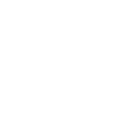

# 👋 Hi, I'm Jason Zhuang

🎸 I'm a software engineer and guitar lover

📺 I like to watch anime and manga

🌄 Check out the NFT gallery I created: [NFT Showroom](https://d3idtkbaj4rnb4.cloudfront.net) and mint my awesome Cutie Squid Collection by MetaMask.

## 📫 Find me on

## 🖥️ Languages and Tools

<!-- 
 -->

 
 

 
 
 

---

## 📕 Latest Blog Posts

<!-- BLOG-POST-LIST:START -->
- [Master TypeScript Mapped Types](https://blog.jasonzhuang.com/blog/2023/03/24/master-typescript-mapped-types)
- [手機網頁的滿版可能跟你想的不同](https://blog.jasonzhuang.com/blog/2023/02/19/mobile-viewport-height-unit)
- [從零開始的 2023 年 前端工程師 Mac 配置](https://blog.jasonzhuang.com/blog/2023/01/20/mac-setup-for-frontend-developer)
- [TypeScript 進階 5 種技巧](https://blog.jasonzhuang.com/blog/2022/05/19/typescript-advance-5tips)
- [Next.js 與 React.js 在圖檔引入上的差異。](https://blog.jasonzhuang.com/blog/2022/04/27/nextjs-react-import-svg)
<!-- BLOG-POST-LIST:END -->

➡️ [more...](https://blog.jasonzhuang.com)

---

## 🧪 Side Projects

### NFT Showroom

> A NFT showroom allow user to mint NFT.

     

  

🔗 Repo: [https://github.com/jason71708/nft-showroom](https://github.com/jason71708/nft-showroom)

🔗 Site: [https://d3idtkbaj4rnb4.cloudfront.net](https://d3idtkbaj4rnb4.cloudfront.net)

### Coast FIRE Calculator CLI

> Interactive CLI to estimate your Coast FIRE age.

  

  

🔗 Repo: [https://github.com/jason71708/coast-fire-calculator-cli](https://github.com/jason71708/coast-fire-calculator-cli)

### Discord Bot

> Node.js Discord bot to manage an AWS EC2-hosted Project Zomboid server, provide Soulworker guides, and simple responses.

   

  

🔗 Repo: [https://github.com/jason71708/discord-bot](https://github.com/jason71708/discord-bot)

### Taiwan Bicycle Travel

> Taiwan Bicycle Travel Website.

   

  

🔗 Repo: [https://github.com/jason71708/F2E2021-taiwan-bicycle-travel](https://github.com/jason71708/F2E2021-taiwan-bicycle-travel)

🔗 Site: [https://jason71708.github.io/F2E2021-taiwan-bicycle-travel/bicycle](https://jason71708.github.io/F2E2021-taiwan-bicycle-travel/bicycle)

### Taiwan Tourist Attractions

> Taiwan Tourist Attractions Guide Website.

    

  

🔗 Repo: [https://github.com/jason71708/F2E2021-taiwan-tourist-attractions](https://github.com/jason71708/F2E2021-taiwan-tourist-attractions)

🔗 Site: [https://jason71708.github.io/F2E2021-taiwan-tourist-attractions/](https://jason71708.github.io/F2E2021-taiwan-tourist-attractions/)

### Jablog

> A tech blog about Front-end, DevOps and any software-development-related knowledge.

    

  

🔗 Repo: [https://github.com/jason71708/jablog](https://github.com/jason71708/jablog)

🔗 Site: [https://blog.jasonzhuang.com](https://blog.jasonzhuang.com)

---

## ⚡ GitHub Stats

[website]: https://blog.jasonzhuang.com
[email]: mailto:jason71708@gmail.com